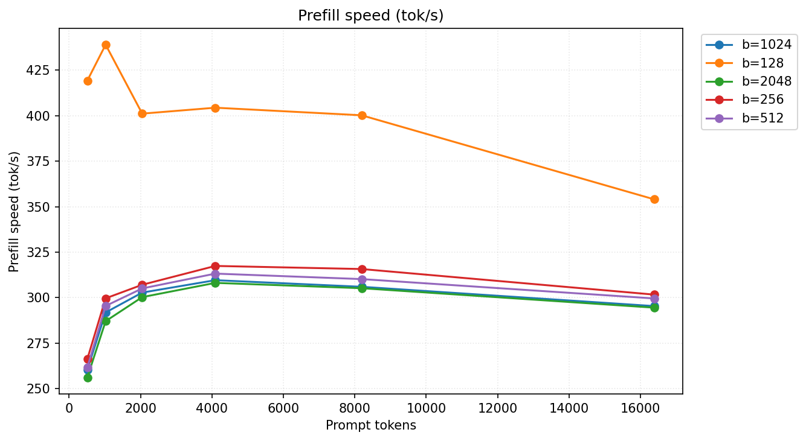
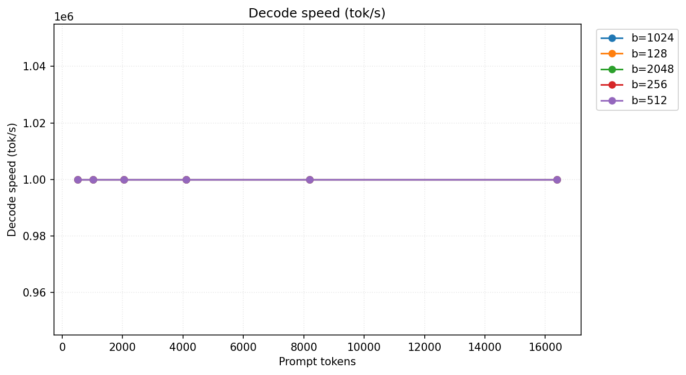

# Server Settings Benchmark — Prefill Speed

Prefill tok/s by batch size and prompt length. Best value per column in **bold**.

| config | 512t      | 1024t     | 2048t     | 4096t     | 8192t     | 16384t    |
| ------ | --------- | --------- | --------- | --------- | --------- | --------- |
| b=1024 | 260.5     | 291.9     | 302.8     | 309.6     | 306.0     | 295.4     |
| b=128  | **419.2** | **438.9** | **401.1** | **404.3** | **400.2** | **354.0** |
| b=2048 | 256.3     | 287.1     | 300.3     | 308.1     | 305.2     | 294.5     |
| b=256  | 266.4     | 299.7     | 307.1     | 317.4     | 315.7     | 301.7     |
| b=512  | 261.8     | 295.5     | 305.1     | 313.2     | 310.2     | 299.6     |

## Charts

